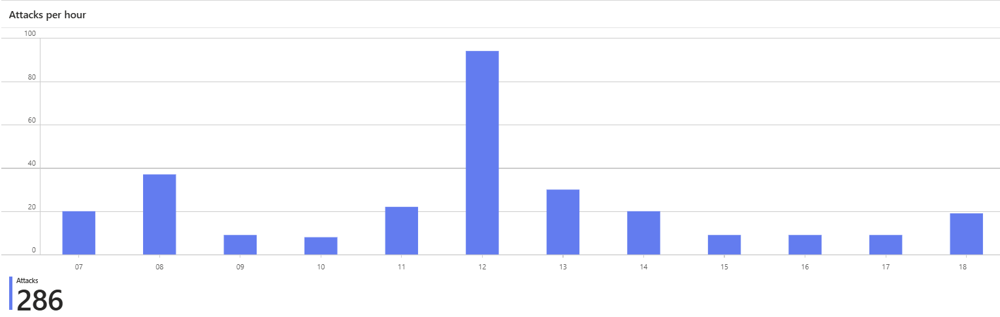
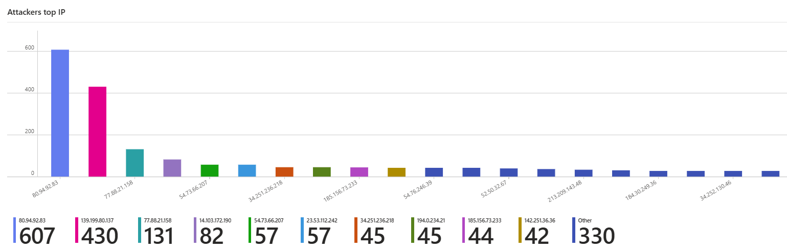
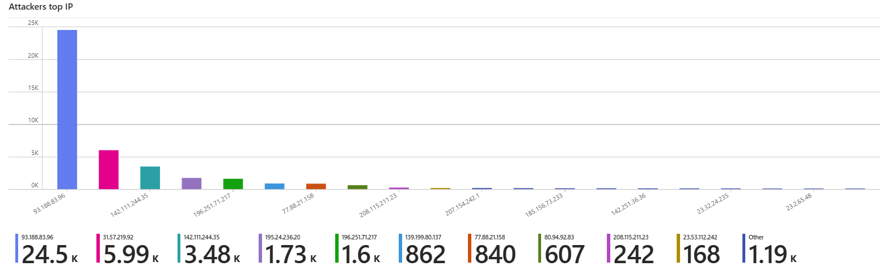
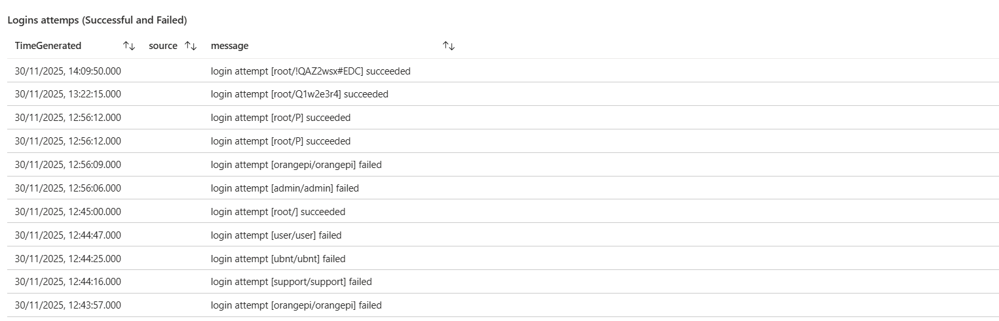
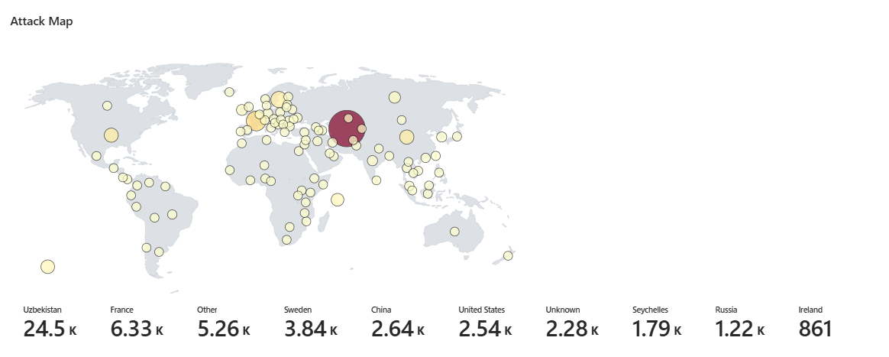

# Azure-Honeypot-Cowrie
This is a cloud hosted SSH honeypot deployed in Microsoft Azure using cowrie. This is integrated with data collection rules, log analytics and a security monitoring dashboard through Azure Workbooks.
This project captures attackers behaviour in real time, highlighting credentials used, brute force, commands used and locations of attackers, all of which are automated and collected and displayed via the monitoring dashboard.

Project Overview:
This honeypot was created to simulate a vulnerable server, which is exposed to the internet, and the goal was to safely observe the actions of attackers when they attempt to breach the system.
Once the Virtual Machine was successfully deployed and running, it had received several thousand attempts to break into the system. The attackers had attempted various techniques:
-Login brute force
-Stuffing credentials
-Execution of malicious commands
-Potentially injecting malware

Cowrie had successfully captured the attackers activity, and through using data collection rules and log analytics, the results were presented into the azure workbook, serving as a dashboard to display and review attacks.

Technologies Used:
Microsoft Azure - 
Resource Group
Virtual Machine (Ubuntu)
Network Security Group (NSG)
Log Analytics Workspace
Data Collection Rules
Azure Monitor Agent
Azure Workbooks

Linux-
Checking logs
Inspecting network and processes

Cowrie-
SSH Honeypot
Collects login attempts, commands, session details, IP address and more.

Kusto Query Language (KQL)-
Query and collect attack data and create visuals in log analytics, such as bar charts, graphs, and world map.

Project Build:
 1. Created a resource group
This is the container that holds the project together, for easy management, clear organisation, monitoring, and deletion when complete.

 2. Deployed a Virtual Machine (Ubuntu Linux)
The virtual machine serves as the host of the Cowrie honeypot
The Linux VM was deployed with a public IP and exposed to the internet
Attackers will quickly scan the public internet for exposed ports, collecting results quickly

Steps taken:
- deployed the Ubuntu Linux VM
- allowed SSH traffic from the internet
- assigned a public IP, so attackers will reach it
  
 3. Installation and configuration of cowrie (The honeypot)
Cowrie is the honeypot itself that is designed to collect attacker activity, simulating a real server.
Cowrie records the attackers behaviour safely for monitoring later

Steps taken:
- Created a user for cowrie
- Cloned the cowrie github repo onto the VM
- Installed python virtual environment and dependencies - this isolates cowrie from the system and keeps it stable
- Verified that the logs were being stored

 4. Created the Log Analytics Workspace
This is the central storage piece for logs in azure. This is required as cowrie stores its logs in JSON files. Azure is not able to read these files automatically, so the logs are put into the log analytics workspace. This acts as a cloud database which azure can read and extract, and can be queried using KQL

Steps taken:
- Created new Log Analytics Workspace
- Attached it to the resource group
- Logs will now be sent here from the DCR

 5. Created the Data Collection Rule (DCR)
The DCR states what logs to collect from cowrie and where to store them, as Azure does not automatically collect JSON logs, the DCR is needed to inform Azure to read the JSON file, direct it to the Log Analytics Workspace and save it in a custom table.

Steps taken:
- data source set to custom JSON logs
- linked to file path that collects the logs of the honeypot
- destination set to Log Analytics Workspace
- created custom table
- the honeypot VM was then set with this rule

6. Built an Azure Workbook
The Azure Workbook serves as a visualisation of attackers behaviours all in real time. The workbook allows the data to be represented in charts, graphs and maps. Multiple KQL queries can be conducted in one place to create an overview of attacks in various ways.

Steps taken:
- Connected workbook to Log Analytics Workspace
- Used KQL to create the following visuals onto the workbook
      - Attacks per hour
      - Attackers top IP address
      - Successful logins and commands
      - Attacker World Map
  
Dashboard Results:
1. Attacks Per Hour

- Shows over 300,000 attacker events captured over the span of a month
- Can see attack count over a selected time period, such as last 12 hours, last 24 Hours, last 3 days. ect
2. Top Attacker IPs

- Identified different types of IP addresses that have attempted to reach the system, and which are most common.
3. Successful Logins and Commands

- shows the combination of weak and default user credentials that attackers try to log in, and if they were successful.
4. Global Attack Map

- Highlight regions of the world where most of the attacks originate from.
  
Overall Findings:

- Cloud servers that have ports exposed to the internet are attacked very quickly
- Many of the attacks were bots that attempted default & weak login credentials
- Some attackers atttemped to deliver malware and execute commands

Future improvements and developments:

To improve this project further, additional dashboards and detection attempts can be implemented. The workbook could be expanded to add attempts of malware delivery by attackers, command executions, and privilege escalation attempts.

Firewalls, Intrusion detection systems (IDS) and Intrusion Detection Systems (IPS) could also be integrated to block attacks from IPs after repeated failed login attempts. Since this project was built to accept all attacks, changes can be made to block the attackers.

This project has collected useful information about the most common IPs of attackers, such as 93.188.83.96 and 31.57.219.92. This information could be explored further, through utilising tools such as VirusTotal and AbuseIBDP, which are known for threat intelligence. This could show if the IPs found are known botnets or used in other attacks.

Additionally, to simulate a security operations center, alerts could be added when brute force attempts spike, as seen in the Attacks Per Hour (30D) graph, there have been large spikes of brute force attempts on 7th & 13th November. Alerts could also be set up if an attacker executed a successful login attempt or attempted to deliver malware.

A major development to this project would be to implement Infrastructure as Code (IaC) and Continuous Integration/Continuous Deployment (CI/CD). This would transform the project as it automates the deployment of the honeypot environment, similar to a DevSecOps style setup. The project can be repeated and deployed easier and quicker, and any updates and changes can be done automatically too.
